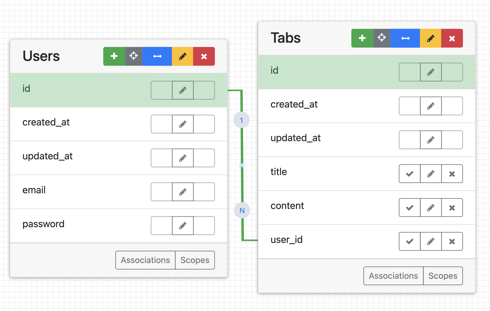
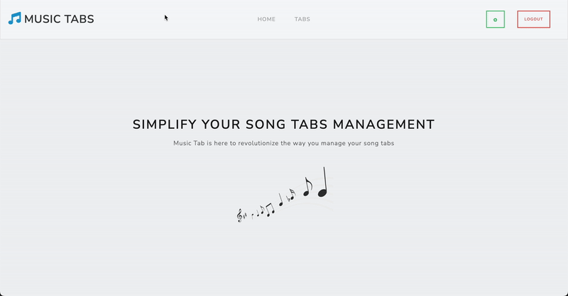
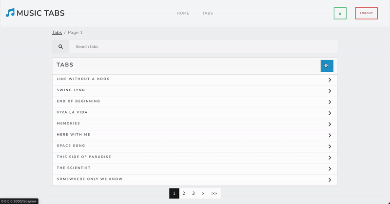
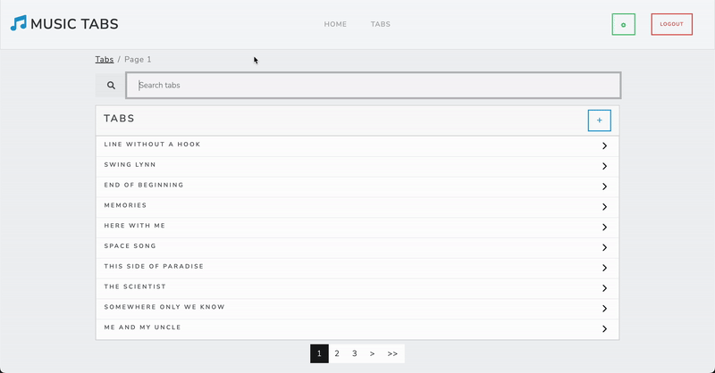
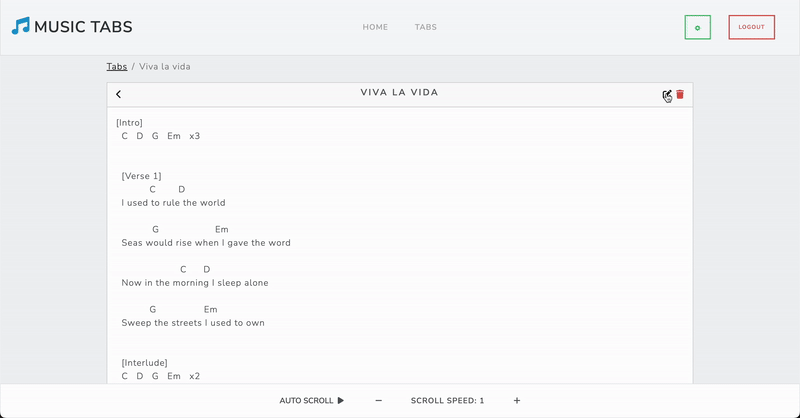

# Music Tab
A user-friendly web application designed to manage song tabs efficiently

## Table of Contents
- [Introduction](#introduction)
- [Instructions](#instructions)
- [Configuration](#configuration)
- [Contributing](#contributing)
    - [Coding Conventions](#coding-conventions)
    - [Branch Naming Conventions](#branch-naming-conventions)
    - [Pull Request Process](#pull-request-process)
- [Entity Relationship Diagram](#entity-relationship-diagram)
- [Troubleshooting](#troubleshooting)
- [Visual Aids](#visual-aids)
- [API Documentation](#api-documentation)
- [Contact](#contact)

## Introduction
Managing song tabs on paper can be a consistent struggle for musicians, leading to lost, damaged, or disorganized materials. **Music Tab** offers a digital solution to this problem, providing a centralized space to create, organize, and access song tabs effortlessly.

## Instructions
To run Music Tab locally:
1. **Clone the Repository**
    ```bash
    git clone https://github.com/your_username/music-tab.git
    cd music-tab
    ```
2. **Install Dependencies**
    ```bash
    bundle install
    ```
3. **Setup the Database**
    ```bash
    rails db:create
    rails db:migrate
    ```
   - Set up sample data for the database (optional)
        ```bash
        rails db:seed
        rails db:sample_data
        ```
4. **Start the Server**
    ```bash
    bin/dev
    ```
   or
    ```bash
    rails server
    ```
5. **Default Admin User**
- email: `alice@example.com`
- password: `password`

## Configuration
No additional configuration is needed for running the app locally.

## Contributing
I welcome any contributions to enhance Music Tab! Please follow the guidelines below:
1. **Fork the Repository**
2. **Create a New Branch** 
    ```bash
    git checkout -b feature/your_feature_name
    ```
3. **Commit Your Changes**
4. **Push to the Branch**
    ```bash
    git push origin feature/your_feature_name
    ```
5. **Create a Pull Request**
    - Describe the changes you've made.
    - Reference any related issues.
6. **Code Review**
    - Participate in the review process and address any feedback.

### Coding Conventions
- Follow the [style guide](https://rubystyle.guide/) for code formatting.
- Ensure all code is well-documented and adheres to best practices.

### Branch Naming Conventions
- Use descriptive names for branches, such as `issue#-description`, `feature/your_feature_name`, or `bugfix/issue_number`.

### Pull Request Process
- Create a pull request with a clear description of the changes.
- Ensure that all tests pass and the code is reviewed before merging.

## Entity Relationship Diagram


## Troubleshooting
- **Unable to start the Rails server:** 

  - Ensure all prerequisites are installed correctly. Check for any missing environment variables.

- **Database connection errors:** 

  - Verify that PostgreSQL is running and ensure the database is created and migrated.

- **How do I reset the database?**
    ```bash
    rails db:reset
    ```

## Visual Aids
**View all tabs created**


**Create a new tab**


**View a song tab**


**Edit an existing tab**


## API Documentation
Music Tab currently does not have its own API endpoints.

## Contact
For any questions or suggestions, please reach out to: bennyjoram@gmail.com
